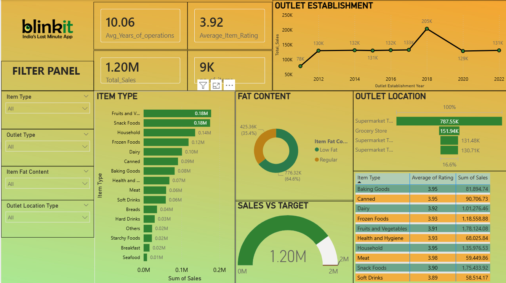

# Blinkit Sales Analysis Dashboard – Power BI

# Project Overview

This project presents a sales analysis dashboard for Blinkit, India’s last-minute grocery delivery app. The dashboard provides insights into product performance, customer preferences, outlet performance, and sales trends using interactive visualizations in Microsoft Power BI.

The goal of this project is to analyze sales data and help businesses make data-driven decisions to improve product strategy, outlet performance, and customer satisfaction.

# Objectives

-Analyze overall sales performance

-Identify top-performing product categories

-Understand customer preferences (Low Fat vs Regular products)

-Evaluate outlet performance by location and type

-Study sales trends across outlet establishment years

-Measure progress toward sales targets

# Tools & Technologies

Microsoft Power BI – Data visualization and dashboard creation

Data Cleaning & Transformation – Power Query

DAX (Data Analysis Expressions) – Measures and calculated fields

Excel / Dataset – Source data

# Dashboard Features
1. KPI Metrics
2. Number of Items: 9K
3. Average Item Rating: 3.92
4. Average Years of Outlet Operation: 10.06

These metrics provide a quick overview of business performance and customer satisfaction.

# Visualizations in the Dashboard
1. Outlet Establishment Trend (Line Chart)

Shows sales distribution based on the year outlets were established.

Insight:

Sales gradually increased from 2012 to 2018

Peak sales occurred in 2018 (≈205K)

Slight decline after 2018 but sales remain stable

Business Value:
Helps identify high-performing outlet establishment periods.

2. Item Type Sales Analysis (Bar Chart)

Displays sales contribution by product category.

# Top Categories:

Fruits & Vegetables

Snack Foods

Household Items

Low Performing Categories:

Seafood

Breakfast

Hard Drinks

# Insight:
Essential grocery products contribute most to overall sales.

3. Fat Content Analysis (Donut Chart)

Compares sales between Low Fat and Regular Fat products.

Results:

Low Fat: ~64.6% of total sales

Regular Fat: ~35.4% of total sales

Insight:
Customers prefer healthier low-fat products.

4. Outlet Location Performance (Bar Chart)

Shows sales performance across different outlet types.

Observation:

Supermarket Type 1 generates the highest sales

Grocery stores generate relatively lower sales

Insight:
Larger outlets contribute more to total revenue.

5. Sales vs Target (Gauge Chart)

Compares actual sales with the business target.

Current Sales: 1.20M

Target Sales: 2M

Insight:
The company has achieved over 50% of its sales target.

6. Product Ratings & Sales Table

Displays average rating and total sales for each product category.

Key observations:

Meat has the highest rating (3.98)

Fruits & Vegetables generate the highest sales

Soft Drinks have comparatively lower ratings and sales

Insight:
Higher customer ratings generally align with strong sales performance.

# Business Insights

Fruits & Vegetables contribute the highest overall sales.

Low-fat products generate more sales than regular-fat products, indicating strong customer preference for healthier items.

Tier 3 outlets perform better compared to Tier 1 and Tier 2 outlets.

Sales reached their peak in 2018 with approximately 204K sales.

There are no items with high visibility but low sales, indicating good product placement.

# Blinkit_Sales DAshboard

# Key Learnings

-Through this project, the following skills were developed:

-Data cleaning and transformation using Power Query

-Creating interactive dashboards in Power BI

-Writing DAX measures

-Extracting business insights from data

-Designing user-friendly data visualizations

# Conclusion

-The dashboard provides valuable insights into sales trends, product performance, and customer preferences for Blinkit. These insights can help businesses improve inventory planning, marketing strategies, and outlet performance.
-The dashboard provides key performance indicators to summarize the overall business performance.
-Total Sales: 1.20M
